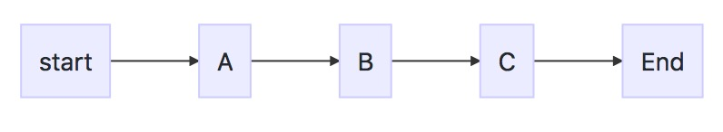
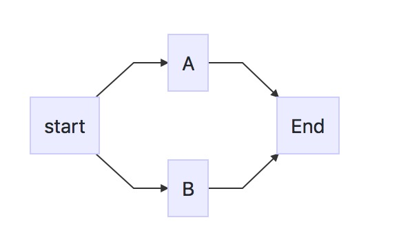
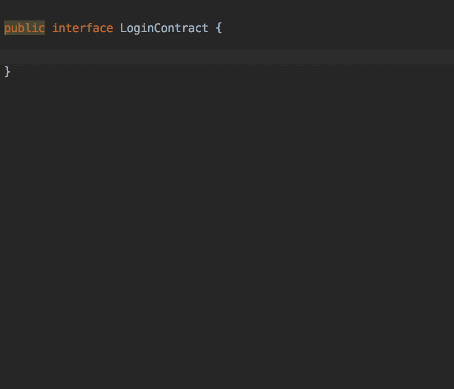

## Tina

Other: [中文版](https://github.com/Tpamore/tina/blob/master/Chinese%20Version)

# Simple API Simple use

## How to use
```groovy
dependencies {
    api 'com.tpa.client:tina:1.1.2'
    annotationProcessor 'com.tpa.client:tina-compiler:1.0.0'

}
```
## Proguard
```java

## request
-keep public class * extends com.tpa.client.tina.model.TinaBaseRequest {
    public void set*(***);
    public *** get*();
    public *** is*();
}

## response
-keep public class * extends ${BaseResponseClass} {
    *;
}

```


## init

```java
public interface TinaConfig {
    /** okhttpclient config **/
    public @NonNull OkHttpClient getOkhttpClient();

    /** mediaType config **/
    public @NonNull MediaType getMediaType();

    /** host url **/
    public @NonNull String getHost();

    public @Nonable TinaFilter getTinaFilter();

    /** It is typically used to encrypt the request body data **/
    public @Nullable TinaConvert getRequestConvert();
}

Tina.initConfig(tinaConfig);   
```

## Single request

#### The flow chart


```java
@Post("url")
public class Reqest extends TinaBaseRequest{

   private String name = "tqf";
   private String sex = "man";
        
 }

------------------------------------------------------

Reqest request = new Reqest();
Tina.build()
        .call(request)
        .callBack(new TinaSingleCallBack<Response>() {
            @Override
            public void onSuccess(Response response) {

            }

            @Override
            public void onFail(TinaException e) {

            }
        })
        .request();

```

## Chain request

#### The flow chart



```java
@Post("url")
public class Reqest extends TinaBaseRequest{

   private String name = "tqf";
   private String sex = "man";
        
 }
    
------------------------------------------

Reqest request = new Reqest();
Tina.build(Tina.CHAINS)
        .call(request)
        .call(request)
        .callBack(new TinaChainCallBack<TinaBaseResponse>() {
            @Override
            public Object onSuccess(Object feedbackResult,TinaBaseResponse response) {
                return null;
            }

            @Override
            public void onFail(TinaException e) {

            }
        })
        .callBack(new TinaChainCallBack<TinaBaseResponse>() {
            @Override
            public Object onSuccess(Object feedbackResult, TinaBaseResponse response) {
                return null;
            }

            @Override
            public void onFail(TinaException e) {

            }
        })
        .request();
```


#### TinaChainCallBack
- feedbackResult : The result passed from the previous request
- return : The result passed to the next request. If TinaChain.FUSING is returned, the chain request is interrupted.


## Concurrent request
#### The flow chart



```java
@Post("url")
public class Reqest extends TinaBaseRequest{

   private String name = "tqf";
   private String sex = "man";
        
 }
 
 ----------------------------------------------------------
    
Reqest request = new Reqest();
Tina.build(Tina.CONCURRENT)
        .call(request)
        .call(request)
        .callBack(new TinaSingleCallBack<TinaBaseResponse>() {
            @Override
            public void onSuccess(TinaBaseResponse response) {
            }

            @Override
            public void onFail(TinaException e) {
            }
        })
        .callBack(new TinaSingleCallBack<TinaBaseResponse>() {
            @Override
            public void onSuccess(TinaBaseResponse response) {
            }

            @Override
            public void onFail(TinaException e) {
            }
        })
        .request();
```

## startCallBack and endCallBack
```java
...
.startCallBack(new TinaStartCallBack() {
    @Override
    public void start() {        
    }
})
.endCallBack(new TinaEndCallBack() {
    @Override
    public void end() {            
    }
})
...
```

## filter

```java
Tina.build()
          .filter(new TinaFilter() {
                    @Override
                    public TinaFilterResult filter(TinaBaseRequest request, byte[] body, Class expect) {
                        return null;
                    }
                })
         ...
```
### Customize the response class type
```java

        Tina.build()
                .filter(BitmapFilter.build())
                .callBack(request)
                .callBack(new TinaSingleCallBack<Bitmap>() {
                    @Override
                    public void onSuccess(Bitmap bitmap) {

                    }

                    @Override
                    public void onFail(TinaException e) {

                    }
                })
                .request();

```

## deamon
```java
        Tina.build()
                .deamon(activity)
                ...
```
A request will be cancelled with the activity's destoryed

## @AutoModel

#### how to use
```java
@AutoMode
public class AnswererListResponse {
}
```
The @Automodel annotated resposne recursively loops around the entire response model, filling in all the empty objects.

#### Before
```java
if(data != null && data.getData1() != null && data.getData1().getData2 != null){
    do(data.getData1().getData2());
}
else{
    //do somethings
}
```
#### After
```java
do(data.getData1().getData2());
```
#### @IgnoreInfate
Ignore inject

### @NumberScale

```java
@AutoMode
public class Response {
    @NumberScale(2)
    private String data = 3.1415926; // 3.14
}
```

### @NotNull
```java
@AutoMode
public class Response {
    @NotNull(message = "data field cannot be empty")
    private String data;
}
```

### Custom annotations

> See the implementation of @notnull and @numberscale for details

```java
@Retention(RetentionPolicy.RUNTIME)
@Target(ElementType.FIELD)
public @interface NotNull {
    public String message() default "";
}

public class NotNullHandler implements TinaAnnotationHandler<NotNull>{
    @Override
    public void hanld(NotNull annotation, Object host, Field field) throws TinaDataException{
        try {
            Object o = field.get(host);
            if (o == null) {
                throw new TinaDataException(annotation.message());
            }
        } catch (IllegalAccessException e) {
        }
    }
}
TinaAnnotationManager.getInstance().register(NotNull.class , new NotNullHandler());
```


## @Cache
```java
@Cache(key = "key" , expire = 1000 , unit = TimeUnit.SECONDS)
public class Request extends TinaBaseRequest {

}
Request request = new Request();

// If the cache is hit, no network request is called. Single CallBack
Tina.build()
        .call(request)
        .callBack(new TinaSingleCallBack<Response>() {
            @Override
            public void onSuccess(Response response) {
                //response
            }
            @Override
            public void onFail(TinaException exception) {

            }
        })
        .request();

// A network request is called regardless of whether the cache is hit or not. Double CallBack
Tina.build()
        .call(request)
        .callBack(new TinaSingleCacheCallBack<Response>() {
            @Override
            public void onSuccess(Response response) {
                //fresh response
            }
            @Override
            public void onCache(Response response) {
                //cache response
            }
            @Override
            public void onFail(TinaException exception) {

            }
        })
        .request();
```

## about restful
> support `POST`、`GET`、`PUT`、`DELETE`、`PATCH`。


### Grammar 1
```java
    @Delete("/name/{name}/sex/{sex}")
    public class Reqest extends TinaBaseRequest{

        @Path("name")
        private String name = "tqf";

        @Path("sex")
        private String sex = "man";
        
    }
    
    >>> DELETE /name/tqf/sex/man
```

### Grammar 2
```java
    @Delete("/name/:name/sex/:sex")
    public class Reqest extends TinaBaseRequest{

        private String name = "tqf";

        private String sex = "man";
        
    }
    
    >>> DELETE /name/tqf/sex/man
    
    @Delete("/name/:name/sex/:sex?")
    public class Reqest extends TinaBaseRequest{

        private String name = "tqf";

        private String sex = null;
        
    }
    
    >>> DELETE /name/tqf/sex
```


## Multi-configuration support

```java
@ConfigId("Pay")
class Config implements TinaConfig{
    ...
}

Tina.addConfig(new Config());


--- gradle clean build ---


/*
*  Automatically generate PayTina
*/
PayTina.build()...

```

## live templates

### import

First, download the settings.jar and keep it local [>>>>> settings.jar](setting/settings.jar)

**Open AndroidStudio and select AndroidStudio - File - Import Setttings**

Select the setting.jar

### abbreviation
- tina_contract : Generate model contract
- tina_singleReq : Generate a simple request
- tina_singleReq2 : Generate simple requests with endCallBack and startCallBack
- tina_chainReq : Generate chain request
- tina_chainReq2 : Generate chain requests with endCallBack and startCallBack
- tina_concurrentReq : Generate a concurrent request
- tina_concurrentReq2 : Generate a concurrent request with endCallBack and startCallBack




> Provided as a simple reference, live templates can be modified to suit your business needs

## Email
736969519@qq.com
